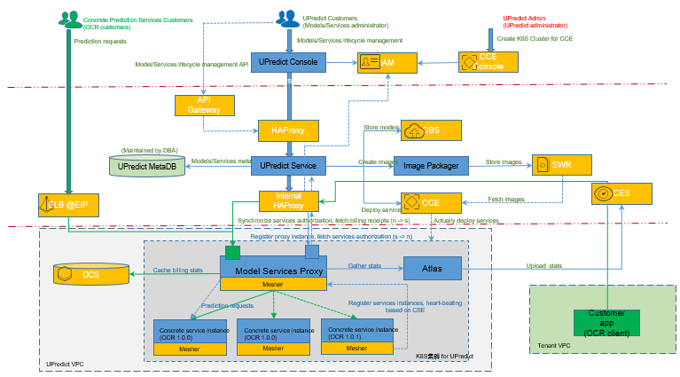

# 华为开源项目Mesher

在service mesh概念出现前，华为的公有云产品CSE已经拥有java与go语言的微服务编程框架，
mesher的补充使得使用多语言或者其他语言的团队能够快速地将应用微服务化。
华为工程师田晓亮在6月份的LC3和12月的KubeCon大会讲解了商业产品CSE mesher在生产环境中的实践，
讲述了几个生产环境的项目。
也希望給仍在观望的用户一些参考，哪些场景下已经开始在使用service mesh了

1. 楼宇管理系统的SaaS化：

在这个场景中，用户自己拥有一个大的单体PHP应用，该应用管理楼宇中的人力和设备，
在内部使用觉得非常不错的情况下，希望能将此应用上云，成为一款SaaS，对外提供服务，
产生更大的价值。用户将单体的PHP服务快速地拆分为3个微服务，接入到Mesher当中，
并使用华为云的微服务平台进行部署。整个改造并上云进入生产的过程仅仅一个月，
可以想象，如果自己开发PHP编程框架，然后再改造的过程是多么繁琐。
这个时候，让开发人员更加专注于业务代码，而免去分布式系统带来的复杂性，
便是service mesh带来的最大的价值，开发效率有着显著地提升。

2. 模型训练平台ModelArts（Model as a service）：

用户使用CSE Mesher及容器平台等多种云服务，打造了自己的模型训练平台。
初衷是，帮助不关心分布式系统复杂性的模型训练服务开发者
能够快速地将自己的服务发布为一款云服务，并对外向其他开发者提供服务。
而在部署到云端后，每个模型训练服务都变为了微服务，具备了熔断，限流，路由等诸多高级特性

另外还有些项目仅仅是简单地接入多语言，用户大部分服务都使用java开发框架开发，
只有一个前台服务用NodeJS编写，使用Mesher接入，
这个时候Mesher主要承担的是完善微服务方案完整性的角色

在生产中得到了验证后，
华为在8月份开源了自己的 [Service Mesh](https://github.com/go-mesh/mesher)，
以完善ServiceComb开源生态